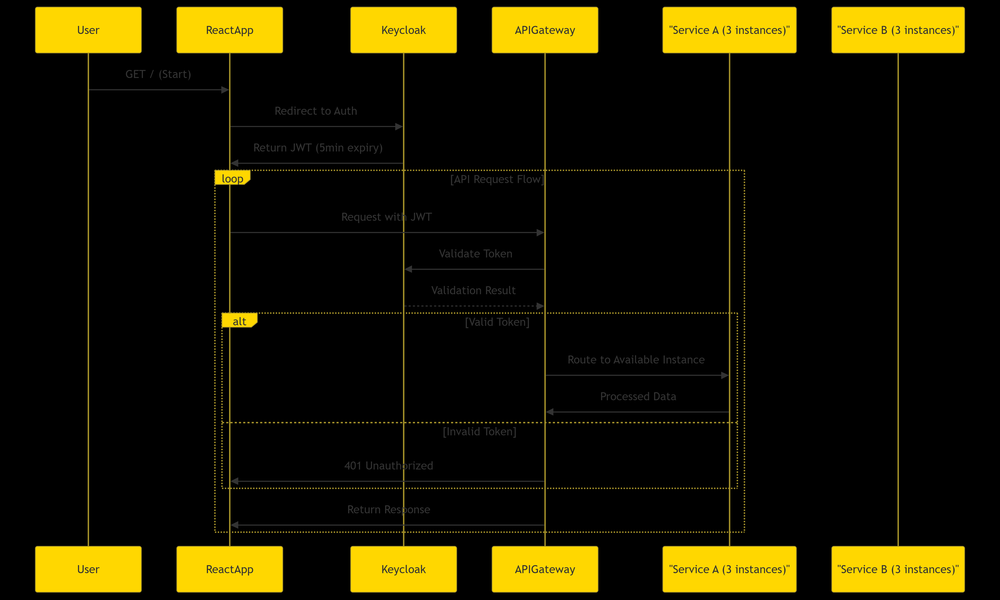

Here's the updated README.md file incorporating your changes and explaining the host file modifications:

# 🔐 Spring Boot OAuth2 Integration with Keycloak & React Frontend

## 📌 Key Modifications

### Hosts File Update

I added `127.0.0.1 keycloak` to the Windows hosts file to:

- Resolve container-to-container communication issues
- Ensure consistent hostname resolution between:
  - Browser (host machine)
  - React app (host machine)
  - API Gateway (container)
  - Other microservices (containers)
- Maintain identical JWT issuer validation across all components

## 🚀 Stack Overview

- **Spring Boot** (OAuth2 Resource Server)
- **Keycloak** (Authorization Server)
- **PostgreSQL** (Database for Keycloak)
- **React** (Frontend with Keycloak JS adapter)
- **Docker Compose** (Container orchestration)

## 🛠️ Updated Setup Instructions

### 1. System Preparation

#### Windows Hosts File Modification

1. Open Notepad as Administrator
2. Edit `C:\Windows\System32\drivers\etc\hosts`
3. Add this line:
   ```
   127.0.0.1 keycloak
   ```
4. Save the file and flush DNS:
   ```bash
   ipconfig /flushdns
   ```

### 2. Docker Configuration

Updated `docker-compose.yml` now includes:

```yaml
services:
  keycloak:
    hostname: keycloak
    environment:
      KC_HOSTNAME: keycloak
      KC_HOSTNAME_STRICT: "false"
    ports:
      - "8080:8080"
```

### 3. Keycloak Access Points

- **From host machine**: `http://localhost:8080`
- **From containers**: `http://keycloak:8080`
- **JWT issuer**: `http://keycloak:8080/realms/Micro-Service`

### 4. React Configuration

```javascript
// Use this for development.
const keycloak = new Keycloak({
  url: "http://localhost:8080/",
  realm: "Micro-Service",
  clientId: "springboot-app",
});

// Or for containerized deployment.
const keycloak = new Keycloak({
  url: "http://keycloak:8080/",
  realm: "Micro-Service",
  clientId: "springboot-app",
});
```

### 5. API Gateway Configuration

```yaml
spring:
  security:
    oauth2:
      resourceserver:
        jwt:
          issuer-uri: http://keycloak:8080/realms/Micro-Service
```

## 🌟 Why These Changes?

1. **Consistent Networking**:

   - All services now resolve `keycloak` to the same endpoint
   - Eliminates JWT validation errors due to issuer mismatch

2. **Development Flexibility**:

   - Works seamlessly in both development and containerized environments
   - Supports local testing while maintaining production parity

3. **Simplified Configuration**:
   - Single hostname used across all services
   - No environment-specific configurations needed

## 🔄 Updated Authentication Flow



## 💡 Support & Contact

For any assistance with this implementation, please reach out to:

**Varun Kadam**  
📧 [kadamvarun94@gmail.com](mailto:kadamvarun94@gmail.com)

### We welcome:

- 🐛 **Bug reports** - Help improve stability
- 💡 **Implementation questions** - Clarifications on setup
- ✨ **Enhancement suggestions** - Feature improvements
- 🔒 **Security recommendations** - Vulnerability reports

### Preferred contact methods:

1. Email for detailed technical queries
2. GitHub Issues for bug tracking
3. Pull Requests for code contributions

---
